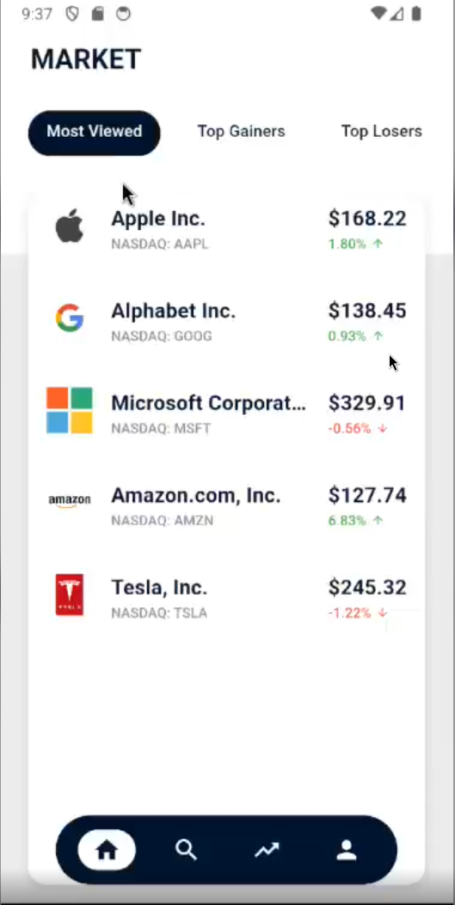
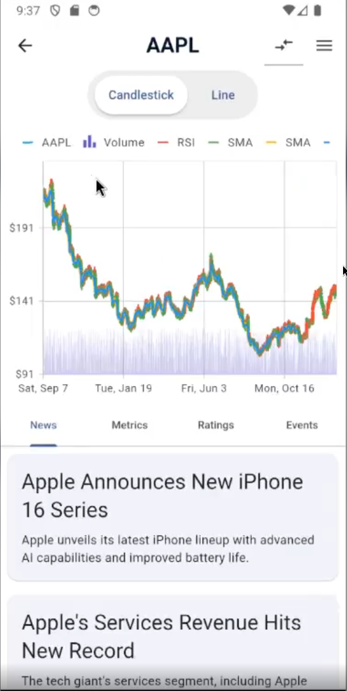
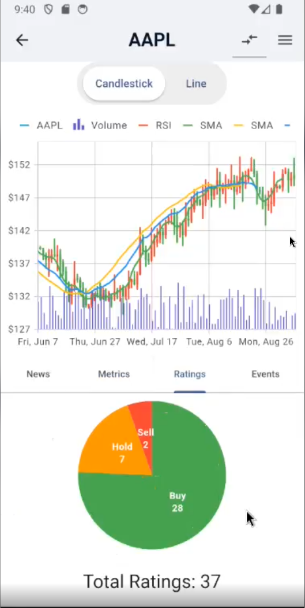
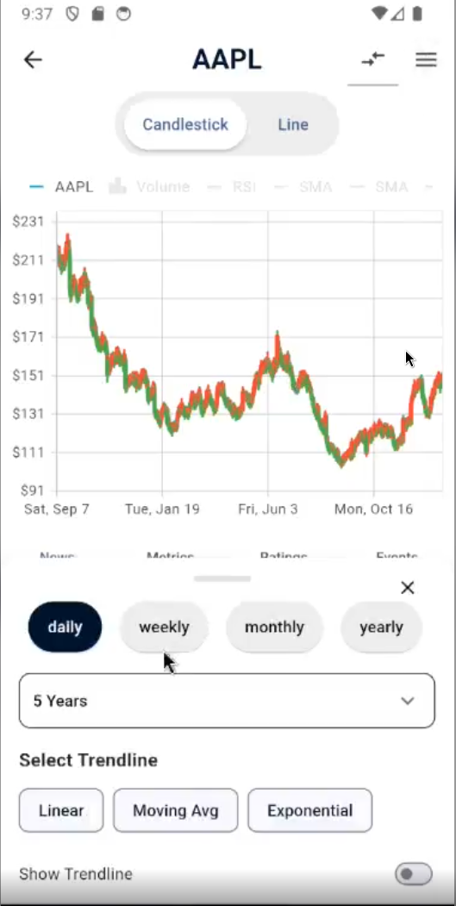
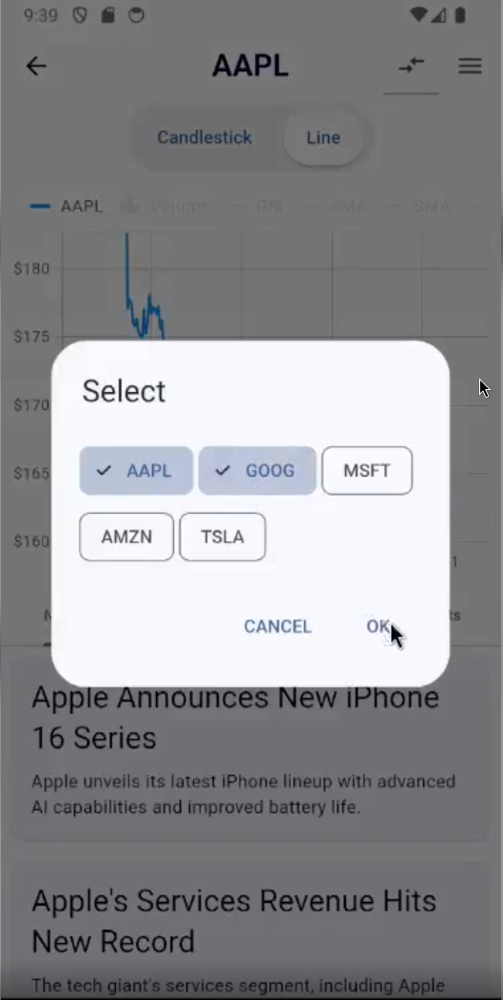
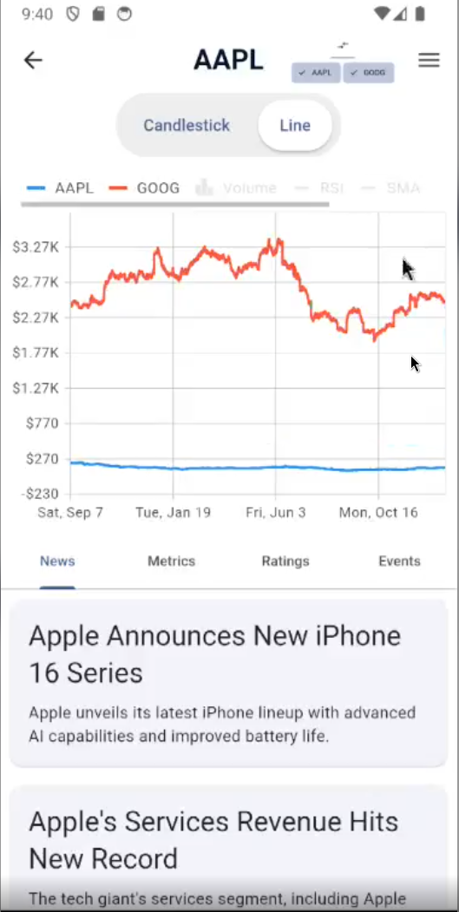

# TrendScope: A Flutter App for Visualizing Stock Market Data

  <!-- Add a logo here if you have one -->
    <!-- Replace with your logo path -->

TrendScope is a Flutter application designed to visualize historical stock market data. It fetches data from a mock API built with Python and Flask, providing users with interactive charts and key stock information.  This documentation outlines the project's architecture, features, installation process, and future development plans.

## Table of Contents

* [Project Overview](#project-overview)
* [Features](#features)
* [Screenshots](#screenshots)
* [Demo Video](#demo-video)
* [Architecture](#architecture)
* [Frontend (Flutter)](#frontend-flutter)
* [Backend (Python/Flask)](#backend-pythonflask)
* [Installation and Setup](#installation-and-setup)
* [API Endpoints](#api-endpoints)
* [Data Model](#data-model)
* [Future Improvements](#future-improvements)

## Project Overview

TrendScope allows users to view historical stock data in various timeframes (daily, weekly, monthly, yearly, and five-yearly).  The application uses a mock API for data retrieval, which simulates a real-world data source.  The focus is on providing a clean and informative user interface with interactive charting capabilities.

## Features

* **Stock Listing:** Displays a list of companies with their symbols, current price, and percentage change.
* **Stock Charting:** Presents historical stock data using candlestick and line charts.
* **Multiple Timeframes:**  Supports viewing data in daily, weekly, monthly, yearly, and five-year periods.
* **Interactive Charts:**  Allows zooming and panning for detailed analysis.
* **Chart Indicators:** Includes RSI, SMA, and EMA indicators for technical analysis.
* **Trendlines:**  Supports visualizing linear, moving average, and exponential trendlines.
* **Stock Comparison:** Enables comparing multiple stocks on the same chart.
* **Stock Details:**  Provides tabs for viewing News, Metrics, Ratings, and Events related to the selected stock (currently placeholder data).

## Screenshots

### Market View and Stock Charts

View Screenshots

| Market Overview | Stock View | Overview | Stock Chart (Candlestick) | Chart Configuration | Stock Comparison |
|:---:|:---:|:---:|:---:|:---:|:---:|
|  |  |  |  |   |  |

## Demo Video

Watch Demo

<video src="screenshots/trendscope_demo.mp4" width="300" controls></video>

## Architecture

TrendScope employs a clear separation of concerns with a focus on maintainability and scalability.

* **Frontend (Flutter):** The frontend follows a Model-View-Provider architecture using Riverpod for state management. This approach ensures a unidirectional data flow and simplifies complex state management.
* **Backend (Python/Flask):**  A lightweight Flask server serves as the mock API, providing sample stock data in JSON format.
* **Communication:** The Flutter app communicates with the backend via HTTP requests to fetch stock data.

## Frontend (Flutter)

* **Code Organization:** The Flutter codebase is structured using a feature-based approach, separating concerns into distinct folders (e.g., `presentation/market`, `presentation/stock_chart`).
* **State Management:** Riverpod is used for state management, providing a robust and testable way to handle application state.
* **Key Packages:**
  * `flutter_riverpod`: For state management.
  * `syncfusion_flutter_charts`:  For creating interactive charts.
  * `dio`: For making HTTP requests.
  * `retrofit`: For defining the API interface.
  * `freezed`: For immutable data classes.
  * `json_serializable`:  For JSON serialization and deserialization.
  * `multi_select_flutter`: For selecting multiple stocks for comparison.

## Backend (Python/Flask)

* **Mock API:**  The backend is a simple Flask server that serves mock stock data from a JSON file (`sample_stock_data.json`).
* **Endpoints:** Provides endpoints for fetching stock lists and historical data.

## Installation and Setup

1. **Backend Setup:**
    * Ensure Python is installed on your system.
    * Install Flask: `pip install Flask`
    * Run the Flask server: `python mock_api.py` (from the directory containing the Python code)

2. **Frontend Setup:**
    * Ensure Flutter is installed and configured on your system.
    * Navigate to the `trendscope` directory (containing the Flutter code).
    * Install dependencies: `flutter pub get`
    * Run the app: `flutter run`

## API Endpoints

* `/stocks`: Returns a list of stocks with their details (symbol, company name, price, etc.).
* `/query`: Returns historical stock data.  Requires query parameters:
  * `function`: The type of time series data (e.g., `TIME_SERIES_DAILY`, `TIME_SERIES_WEEKLY`).
  * `symbol`: The stock symbol.

## Data Model

The core data models are defined using Freezed, promoting immutability and code generation:

* `StockData`: Represents the historical stock data, including metadata and time series data.
* `StocksResponse`: Represents the list of stocks returned by the `/stocks` endpoint.
* `ChartData`:  A simplified data model specifically for the chart library.

## Future Improvements

* **Real-time Data:** Integrate with a real-time stock data API.
* **User Authentication:**  Implement user authentication and personalized watchlists.
* **More Charting Features:** Add more chart types and technical indicators.
* **Improved Stock Details:**  Fetch and display actual news, metrics, ratings, and events data.
* **UI/UX Enhancements:**  Refine the user interface and user experience for improved usability.
* **Error Handling:** Implement more robust error handling throughout the application.
* **Testing:**  Add comprehensive unit and integration tests.
